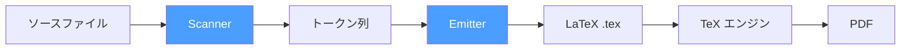
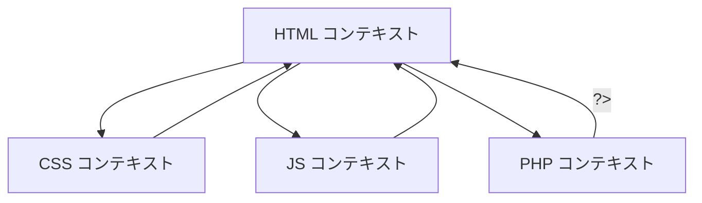

# src2tex-go v2.236 のアーキテクチャ

## 概要

src2tex は、プログラムのソースコードを LaTeX 文書に変換するユーティリティです。

1990年代に C で書かれた原版（v2.12）を Go で再実装し、モダンな Unicode 対応・マルチエンジン対応・フォント管理を実現しました。


## オリジナル (v2.12) / 旧バージョン (v2.23) との設計方針の違い

| 項目 | v2.12/ v2.23  | v2.236 (Go) |
|------|-----------------|------------|
| **言語対応** | ソースコードに条件分岐を追加 | テーブル駆動 (`LangDef` 構造体) |
| **エンジン** | テンプレートをハードコード | テンプレート + エンジン設定 (JSON) |
| **フォント** | 固定 | CLI + 自動検出 + インストーラ |
| **複合言語** | 未対応 | コンテキストスタック機構 |
| **TeX パススルー** | `{\ ... }` マーカー | 同じ記法、`\parbox` 自動ラッピング |
| **拡張性** | C ソース修正が必要 | JSON + テンプレートファイル編集で対応 |
| **コンパイル** | C89 コンパイラ | Go コンパイラ |
| **TeX** | pTeX / pLaTeX / jTeX / jLaTeX | XeLaTeX / LuaLaTeX / upLaTeX / pdfLaTeX $^1$ |

<small>1: pdfLaTeXは英語圏文書のみの想定</small>


### 設計思想

1. **テーブル駆動**: 新言語の追加は `lang.go` に `LangDef` を1行追加するだけ（想定のコメント形式）
2. **テンプレート分離**: プリアンブルを外部テンプレート化し、ユーザーがカスタマイズ可能
3. **フォールバック付き安全設計**: テンプレートのロード失敗時はハードコード版にフォールバック
4. **TeX の美学を尊重**: IDE 的なカラーシンタックスではなく、TeX 組版の美しさを重視
5. **現代的な書体を意識**: 白源 (HackGen) などのプログラミング用フォントへの対応


## プログラム構成

```
src2tex-go-v2.236/
├── cmd/src2tex/
│   └── main.go              # CLI エントリポイント、引数解析、パイプライン制御
├── internal/
│   ├── lang/
│   │   └── lang.go          # 言語定義テーブル (LangDef, CommentStyle, Keywords)
│   ├── scanner/
│   │   └── text2tex.go      # スキャナ: ソース → トークン列 変換
│   ├── emitter/
│   │   ├── latex.go          # エミッタ: トークン列 → LaTeX 出力
│   │   ├── engine.go         # エンジン解決: テンプレート読込 + ユーザーカスタマイズ
│   │   └── templates/        # go:embed 埋め込みテンプレート
│   │       ├── xelatex/      #   XeLaTeX (fontspec + xeCJK)
│   │       ├── lualatex/     #   LuaLaTeX (luatexja-fontspec)
│   │       ├── uplatex/      #   upLaTeX (jsarticle + otf + dvipdfmx)
│   │       └── pdflatex/     #   pdfLaTeX (T1 fontenc, CJK なし)
│   └── font/
│       ├── defaults.go       # プラットフォーム別フォントデフォルト
│       ├── install.go        # フォントダウンロード・インストール
│       └── commentfont.go    # コメントフォント解決 (明朝体自動検出)
├── testdata/
│   ├── input/                # サンプルソースファイル群
│   └── golden/               # ゴールデンテストファイル
├── Taskfile.yml              # ビルド・サンプル変換・検証タスク
└── README.md
```


## 処理パイプライン



### 1. Scanner (`internal/scanner/text2tex.go`)

ソースコードをバイト単位で走査し、トークン列 (`[]Token`) に変換する。

- **状態遷移マシン**: `CodeMode` / `TextMode` / `TeXMode` の3状態
- **コメント検出**: `CommentStyle` に基づき `//`, `/* */`, `#`, `%`, `;`, `<!-- -->` 等を認識
- **TeX パススルー**: `{\ ... }` マーカーを検出して `TeXMode` に遷移
- **複合言語**: `<style>`, `<script>`, `<?php` でサブ言語に切り替え（コンテキストスタック）
- **キーワード**: 識別子をキーワード表と照合し `TokenKeyword` を生成

### 2. Emitter (`internal/emitter/latex.go`)

トークン列を LaTeX コマンドに変換して出力する。

- **WritePreamble**: テンプレートエンジンによるプリアンブル生成
- **WriteBody**: トークンを順に処理し、`\noindent`, `\mbox{}`, `\textbf{}` 等を出力
- **WritePostamble**: `\end{document}` を出力

主な出力変換:

| トークン種別 | LaTeX 出力例 |
|------------|-------------|
| コード文字 | `{\tt\mc \ }` (スペース文字), `{\tt\char'173}` ( `{` ) |
| キーワード | `\textbf{if}` |
| コメント | `\rm\mc` で書体切替 |
| TeX パススルー | `\parbox{0.85\textwidth}{...}` |
| 行番号 | `\rlap{\kern-2.5em{\sevenrm N}}` |

#### コメント内の TeX パススルー処理

コメント内のテキストは通常 `commentTextEscape` で TeX 特殊文字がエスケープされる（例: `$` → `\$`, `_` → `\_`）。しかし、以下の2つのメカニズムにより、TeX コマンドや数式をコメント内に埋め込める。

**1. `{\ ... }` マーカーによるパススルー**

コメント内の `{\ ... }` で囲まれた領域は、`{` と `}` を除去した上で中身がそのまま LaTeX として出力される。

```c
/* {\ Simpsonの公式 \hfill} */
```

パススルー内容が複数行にまたがる場合は、`writePassthroughWithLineBreaks` メソッドにより各改行箇所に `\noindent\mbox{}` が挿入される。これにより TeX の段落モデルとソースコードの行モデルが整合する（空行は `\mbox{}\hfill` として処理される）。ただし、パススルー内の `$...$` / `$$...$$` 数式内の改行にはこれを挿入しない。

旧バージョン (v2.23) では、`{\ ... }` 内の改行は1文字ずつの `Flag` ベース処理で `\noindent\mbox{}` を生成していた。v2.236 ではトークンベースでパススルー内容を一括処理するため、`writePassthroughWithLineBreaks` として独立したメソッドに分離して同等の改行処理を実現した。

**2. `$...$` / `$$...$$` 数式パススルー**

コメント内（`{\ }` ブロックの外）に `$...$` や `$$...$$` が出現した場合、その範囲はエスケープせずそのまま LaTeX 数式として出力される。

```c
#define A 0.          /* 積分をする区間 $[a, b]$ {\hfill} */
```

数式内の文字（`_`, `{`, `}` 等）はエスケープされず、改行も `\noindent\mbox{}` を挿入しない。これにより複数行にまたがる数式が正しくレンダリングされる。

旧バージョン (v2.23) では、コメント全体をバッファで先読みスキャンし、`$` を含むコメントは `RMFlag=1`（TeXパススルーモード）を設定してコメント全体をパススルーしていた。v2.236 では `$...$` の範囲だけを精密にパススルーする方式を採用し、それ以外の文字は通常通りエスケープする。

### 3. Engine (`internal/emitter/engine.go`)

テンプレートシステムの挙動。

```
ユーザーディレクトリ (~/.src2tex/engines/<name>/)
    ↓ (フォールバック)
go:embed 埋め込みテンプレート
```

- **カスタムデリミタ `<% %>`**: TeX の `{}` と Go の `{{}}` の衝突を回避
- **`engine.json`**: エンジン名、コンパイルコマンド、CJK対応、fontspec対応を宣言
- **`preamble.tmpl`**: プリアンブルテンプレート本体


## LaTeX エンジン対応

| エンジン | CJK | fontspec | パッケージ構成 |
|---------|:---:|:--------:|-------------|
| **XeLaTeX** (デフォルト) | ✅ | ✅ | `fontspec` + `xeCJK` |
| **LuaLaTeX** | ✅ | ✅ | `luatexja-fontspec` |
| **upLaTeX** | ✅ | ❌ | `jsarticle` + `otf` + `dvipdfmx` |
| **pdfLaTeX** | ❌ | ❌ | `fontenc` + `inputenc` + `courier` |

### テンプレートカスタマイズ

```bash
# テンプレートをユーザーディレクトリに展開
src2tex engine init

# ~/.src2tex/engines/xelatex/preamble.tmpl を編集
# 変数: <%.PaperSize%>, <%.MonoFontLine%>, <%.CJKMainFont%> 等
```

## フォント管理

### コードフォント (`-font`)

| 優先度 | フォント | 条件 |
|:-----:|---------|------|
| 1 | CMU Typewriter Text | TeX Live 検出時のデフォルト |
| 2 | Courier New | フォールバック |
| 3 | ユーザー指定 | `-font <name>` |

### コメントフォント (`-commentfont`)

日本語コメントの明朝体表示用。自動検出順:

1. `~/.src2tex/fonts/` にインストール済みフォント
2. システムフォント (Hiragino Mincho ProN, Yu Mincho 等)
3. フォールバック: CJK ゴシック体

```bash
# 利用可能フォント一覧
src2tex font list

# フォントをダウンロード・インストール
src2tex font install noto-serif-jp
```

`~/.src2tex/fonts/` をカスタマイズすれば、任意の書体を使えます。


## 言語対応

### 対応言語一覧 (v2.236)

| カテゴリ | 言語 | 拡張子 | `-lang` 値 |
|---------|------|--------|-----------|
| **C 系** | C | `.c`, `.h` | `c` |
| | Go | `.go` | `go` |
| | Java | `.java` | `java` |
| | C++ | `.cpp`, `.cc`, `.cxx`, `.hpp` | `cpp` |
| | C# | `.cs` | `csharp` |
| | Dart | `.dart` | `dart` |
| | JavaScript | `.js`, `.mjs` | `js` |
| | TypeScript | `.ts`, `.tsx` | `ts` |
| | Rust | `.rs` | `rust` |
| | Kotlin | `.kt`, `.kts` | `kotlin` |
| | Swift | `.swift` | `swift` |
| **Hash 系** | Shell | `.sh`, `.bash` | `sh` |
| | Python | `.py` | `python` |
| | Ruby | `.rb` | `ruby` |
| | Perl | `.pl`, `.pm` | `perl` |
| | Makefile | `Makefile` | `make` |
| | Tcl | `.tcl` | `tcl` |
| **Percent 系** | REDUCE | `.red` | `reduce` |
| | MATLAB | `.m` | `matlab` |
| **Semicolon 系** | Lisp/Scheme | `.lisp`, `.scm`, `.el` | `lisp` |
| **Pascal 系** | Pascal | `.pas`, `.p` | `pascal` |
| **マークアップ** | XML | `.xml` 等 | `xml` |
| | CSS | `.css` | `css` |
| | HTML (+CSS/JS/PHP) | `.html`, `.htm`, `.php` | `html` |
| | PHP (埋込み) | — | `php` |

### 新言語の追加方法

基本的には `internal/lang/lang.go` にエントリを追加します。

```go
var myKeywords = []string{"if", "else", "func", ...}

// Languages テーブルに追加:
{Name: "MyLang", Exts: []string{"ml"}, Flag: "mylang",
    Comment: cStyle, Keywords: myKeywords},
```

#### CommentStyle の定義済み定数

多くの言語は以下の定数をそのまま使えます。

```go
var cStyle = CommentStyle{LineComment: "//", BlockOpen: "/*", BlockClose: "*/"}
var hashStyle = CommentStyle{LineComment: "#"}
var percentStyle = CommentStyle{LineComment: "%"}
var semicolonStyle = CommentStyle{LineComment: ";"}
var xmlCommentStyle = CommentStyle{BlockOpen: "<!--", BlockClose: "-->"}
var cssCommentStyle = CommentStyle{BlockOpen: "/*", BlockClose: "*/"}
var phpCommentStyle = CommentStyle{LineComment: "//", BlockOpen: "/*", BlockClose: "*/"}
```

#### CommentStyle のフィールド

特殊なコメント形式を持つ言語では、`CommentStyle` を直接構築します。

| フィールド | 型 | 説明 |
|-----------|-----|------|
| `LineComment` | `string` | 行コメントの開始文字列（例: `"//"`, `"#"`, `"%"`）。空なら行コメントなし |
| `BlockOpen` | `string` | ブロックコメントの開始文字列（例: `"/*"`, `"{"`, `"<!--"`）|
| `BlockClose` | `string` | ブロックコメントの終了文字列（例: `"*/"`, `"}"`, `"-->"`）|
| `AltBlockOpen` | `string` | 代替ブロックコメントの開始文字列（例: Pascal の `"(*"`）|
| `AltBlockClose` | `string` | 代替ブロックコメントの終了文字列（例: Pascal の `"*)"` ）|
| `BlockNestable` | `bool` | ブロックコメントのネストを許可するか（例: Pascal の `{ { } }` ）|
| `RawTeX` | `bool` | コメント内容を TeX としてそのまま出力するか（`commentTextEscape` を適用しない）|
| `DocstringDelimiter` | `string` | 行頭の三重引用符をブロックコメントとして扱う（例: Python の `"""`）|

#### 但し書き: エミッタ側の対応が必要な場合

上記の `LangDef` 追加だけで対応できるのは、コメントマーカーが TeX パススルーマーカー `{\ ... }` と衝突しない言語に限られます。以下のような場合はエミッタ（`internal/emitter/latex.go`）側の修正も必要です。

- **ブロックコメントマーカーが `{ }` の場合**: パススルーマーカー `{\ }` と同じ `{` を使うため、body 先頭パターンによるパススルー判定ロジック（`writeBlockCommentToken` 内）が必要。現在は Pascal 向けに実装済み
- **代替ブロックコメント (`AltBlockOpen`/`AltBlockClose`)**: スキャナでの検出は汎用的に動作するが、エミッタの `detectBlockCommentMarkers` にマーカーペアを追加する必要がある
- **`RawTeX` 言語の追加**: エスケープ処理を完全にスキップするため、テスト対象ファイルでの目視確認が必須

## 複合言語対応

HTML ファイル内の CSS (`<style>`), JavaScript (`<script>`), PHP (`<?php`) を自動認識し、サブ言語のキーワードボールドを適用します。



`SubLanguageRule` の `ImmediateActivation` フラグにより、
PHP の `<?php` のように閉じタグ `>` なしで即座にコンテキスト切替が可能です。


## 検証方法

### 自動テスト

```bash
# Go ユニットテスト
go test ./...

# ゴールデンテスト（出力の回帰テスト）
go test ./internal/emitter/ -run TestGolden -update

# エンジン別コンパイル検証
task verify:all      # 全エンジン一括
task verify:xelatex  # XeLaTeX のみ
task verify:pdflatex # pdfLaTeX のみ (ASCII サンプル)
task verify:lualatex # LuaLaTeX (CJK サンプル)
task verify:uplatex  # upLaTeX + dvipdfmx
```
※ソースを変更し、出力する正解ファイルが変わったらゴールデンテスト内のファイルも差し替えてください。

### PDFの目視確認

各変更後に Ghostscript で PNG 生成し、以下を確認:
- キーワードのボールド
- コメントフォント（明朝/ゴシック）
- TeX パススルーの数式レンダリング
- 行番号の配置
- 用紙サイズとマージン

## 既知の制約

### Java のコメント内 `\u` で始まる TeX コマンド

Java 言語仕様 (JLS §3.3) では、`\uXXXX` がソースコード全体（コメント・文字列リテラル含む）で Unicode エスケープとして解釈されます。そのため、コメント内の TeX パススルーで `\underline`, `\url` 等の `\u` で始まるコマンドを記述すると、Java コンパイラがエラーを出します。

src2tex の変換パイプラインでは `\underline` は正しく処理されるため、**TeX 出力には問題ありません**。これは Java コンパイラ側の制約であり、ソースを Java としてもコンパイル可能な状態に保つ上で影響するものです。

**回避策**: `\underline` の代わりに `\emph` や `\textit` など `\u` 以外で始まるコマンドを使用します。`hanoi.java` ではこの方針を採用しています。

## 今後の展望 (v2.2360 以降の構想)

だいたいやりたいことは実現したので、思いついていません。たぶん、バグフィクス中心になると思います。

| バージョン | 予定内容 |
|-----------|---------|
| 次のリビジョン | Fortran、COBOL言語対応、CJKとそれ以外の書体の出し分けオプション |
| 将来 | Lua 言語対応、シンタックスカラー対応 |

## バージョン番号規則

メジャーバージョンについては、$\sqrt5$ の小数表現を1つずつ増やしていく形です。マイナーバージョンは、v2.236 (リリース日) で区別する予定です。