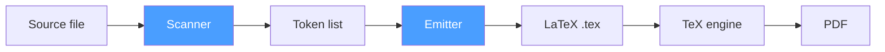
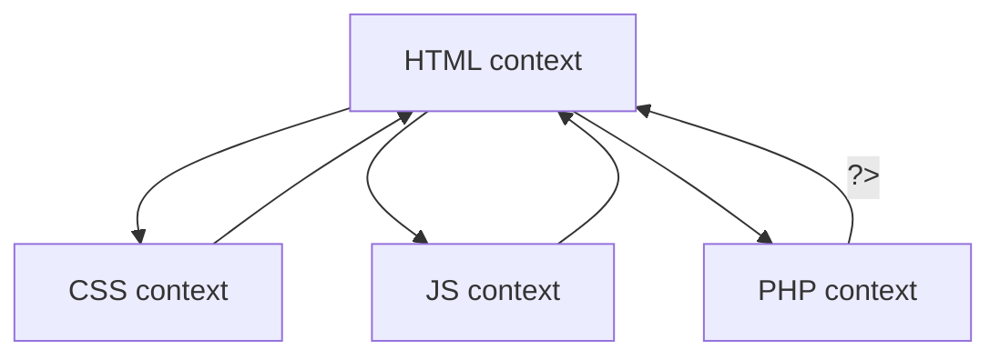

# Architecture of src2tex-go v2.236

## Overview

src2tex is a utility that converts program source code into LaTeX documents.

It is a Go reimplementation of the original C program (v2.12) written in the 1990s, with support for modern Unicode, multiple TeX engines, and flexible font management.


## Differences from the Original (v2.12) and Previous Version (v2.23)

| Aspect | v2.12 / v2.23 | v2.236 (Go) |
|--------|---------------|-------------|
| **Language support** | Conditional branches in source code | Table-driven (`LangDef` struct) |
| **Engine** | Hardcoded template | Template + engine config (JSON) |
| **Fonts** | Fixed | CLI + auto-detection + installer |
| **Composite languages** | Not supported | Context stack mechanism |
| **TeX passthrough** | `{\ ... }` marker | Same syntax, with automatic `\parbox` wrapping |
| **Extensibility** | Requires editing C source | Edit JSON + template files |
| **Compiler** | C89 | Go compiler |
| **TeX** | pTeX / pLaTeX / jTeX / jLaTeX | XeLaTeX / LuaLaTeX / upLaTeX / pdfLaTeX$^1$ |

<small>1: pdfLaTeX is intended for ASCII-only documents.</small>


### Design Philosophy

1. **Table-driven**: Adding a new language requires only one `LangDef` entry in `lang.go`
2. **Template separation**: Preambles are external templates that users can customize
3. **Safe fallback**: If a template fails to load, the hardcoded fallback is used
4. **Respect for TeX aesthetics**: Prioritizes the beauty of TeX typesetting over IDE-style syntax coloring
5. **Modern typefaces**: Support for programming fonts like HackGen (Shirogane)


## Project Structure

```
src2tex-go-v2.236/
├── cmd/src2tex/
│   └── main.go              # CLI entry point: argument parsing, pipeline control
├── internal/
│   ├── lang/
│   │   └── lang.go          # Language definition table (LangDef, CommentStyle, Keywords)
│   ├── scanner/
│   │   └── text2tex.go      # Scanner: source → token list
│   ├── emitter/
│   │   ├── latex.go          # Emitter: token list → LaTeX output
│   │   ├── engine.go         # Engine resolution: template loading + user customization
│   │   └── templates/        # go:embed templates
│   │       ├── xelatex/      #   XeLaTeX (fontspec + xeCJK)
│   │       ├── lualatex/     #   LuaLaTeX (luatexja-fontspec)
│   │       ├── uplatex/      #   upLaTeX (jsarticle + otf + dvipdfmx)
│   │       └── pdflatex/     #   pdfLaTeX (T1 fontenc, no CJK)
│   └── font/
│       ├── defaults.go       # Platform-specific font defaults
│       ├── install.go        # Font download and installation
│       └── commentfont.go    # Comment font resolution (Mincho auto-detection)
├── testdata/
│   ├── input/                # Sample source files
│   └── golden/               # Golden test files
├── Taskfile.yml              # Build, sample conversion, and verification tasks
└── README.md
```


## Processing Pipeline



### 1. Scanner (`internal/scanner/text2tex.go`)

Scans source code byte by byte and converts it into a token list (`[]Token`).

- **State machine**: Three states — `CodeMode`, `TextMode`, `TeXMode`
- **Comment detection**: Recognizes `//`, `/* */`, `#`, `%`, `;`, `<!-- -->`, etc. based on `CommentStyle`
- **TeX passthrough**: Detects `{\ ... }` markers and transitions to `TeXMode`
- **Composite languages**: Switches sub-language context on `<style>`, `<script>`, `<?php` (context stack)
- **Keywords**: Matches identifiers against the keyword table and generates `TokenKeyword`

### 2. Emitter (`internal/emitter/latex.go`)

Converts the token list into LaTeX commands and writes the output.

- **WritePreamble**: Generates the preamble using the template engine
- **WriteBody**: Processes tokens in order, emitting `\noindent`, `\mbox{}`, `\textbf{}`, etc.
- **WritePostamble**: Emits `\end{document}`

Key output conversions:

| Token type | LaTeX output example |
|------------|---------------------|
| Code character | `{\tt\mc \ }` (space), `{\tt\char'173}` (`{`) |
| Keyword | `\textbf{if}` |
| Comment | Font switch with `\rm\mc` |
| TeX passthrough | `\parbox{0.85\textwidth}{...}` |
| Line number | `\rlap{\kern-2.5em{\sevenrm N}}` |

#### TeX Passthrough Inside Comments

Comment text is normally processed by `commentTextEscape`, which escapes TeX special characters (e.g., `$` → `\$`, `_` → `\_`). However, two mechanisms allow you to embed TeX commands and math inside comments.

**1. `{\ ... }` marker passthrough**

Text inside `{\ ... }` in a comment has the surrounding braces stripped, and the contents are output directly as LaTeX.

```c
/* {\ Simpson's rule \hfill} */
```

**2. `$...$` / `$$...$$` math passthrough**

When `$...$` or `$$...$$` appears in a comment (outside a `{\ }` block), that range is output as-is as LaTeX math, without escaping.

```c
#define A 0.          /* integral over $[a, b]$ {\hfill} */
```

Characters inside math (like `_`, `{`, `}`) are not escaped, and line breaks do not get `\noindent\mbox{}` inserted. This allows multi-line math to render correctly.

In v2.23, the entire comment was buffered and pre-scanned; if it contained `$`, the whole comment was set to TeX-passthrough mode (`RMFlag=1`). In v2.236, only the `$...$` range is passed through precisely, and all other characters are escaped as usual.

### 3. Engine (`internal/emitter/engine.go`)

The template system works as follows:

```
User directory (~/.src2tex/engines/<name>/)
    ↓ (fallback)
go:embed built-in templates
```

- **Custom delimiters `<% %>`**: Avoids conflicts between TeX `{}` and Go's `{{}}`
- **`engine.json`**: Declares engine name, compile command, CJK support, and fontspec support
- **`preamble.tmpl`**: The preamble template itself


## LaTeX Engine Support

| Engine | CJK | fontspec | Package setup |
|--------|:---:|:--------:|--------------|
| **XeLaTeX** (default) | ✅ | ✅ | `fontspec` + `xeCJK` |
| **LuaLaTeX** | ✅ | ✅ | `luatexja-fontspec` |
| **upLaTeX** | ✅ | ❌ | `jsarticle` + `otf` + `dvipdfmx` |
| **pdfLaTeX** | ❌ | ❌ | `fontenc` + `inputenc` + `courier` |

### Template Customization

```bash
# Export templates to the user directory
src2tex engine init

# Edit ~/.src2tex/engines/xelatex/preamble.tmpl
# Variables: <%.PaperSize%>, <%.MonoFontLine%>, <%.CJKMainFont%>, etc.
```

## Font Management

### Code font (`-font`)

| Priority | Font | Condition |
|:--------:|------|-----------|
| 1 | CMU Typewriter Text | Default when TeX Live is detected |
| 2 | Courier New | Fallback |
| 3 | User-specified | `-font <name>` |

### Comment font (`-commentfont`)

Used to display Japanese comments in a serif (Mincho) typeface. Auto-detection order:

1. Fonts installed in `~/.src2tex/fonts/`
2. System fonts (Hiragino Mincho ProN, Yu Mincho, etc.)
3. Fallback: CJK sans-serif font

```bash
# List available fonts
src2tex font list

# Download and install a font
src2tex font install noto-serif-jp
```

You can use any typeface by customizing `~/.src2tex/fonts/`.


## Language Support

### Supported Languages (v2.236)

| Category | Language | Extensions | `-lang` value |
|----------|----------|-----------|--------------|
| **C-family** | C | `.c`, `.h` | `c` |
| | Go | `.go` | `go` |
| | Java | `.java` | `java` |
| | C++ | `.cpp`, `.cc`, `.cxx`, `.hpp` | `cpp` |
| | C# | `.cs` | `csharp` |
| | Dart | `.dart` | `dart` |
| | JavaScript | `.js`, `.mjs` | `js` |
| | TypeScript | `.ts`, `.tsx` | `ts` |
| | Rust | `.rs` | `rust` |
| | Kotlin | `.kt`, `.kts` | `kotlin` |
| | Swift | `.swift` | `swift` |
| **Hash-style** | Shell | `.sh`, `.bash` | `sh` |
| | Python | `.py` | `python` |
| | Ruby | `.rb` | `ruby` |
| | Perl | `.pl`, `.pm` | `perl` |
| | Makefile | `Makefile` | `make` |
| | Tcl | `.tcl` | `tcl` |
| **Percent-style** | REDUCE | `.red` | `reduce` |
| | MATLAB | `.m` | `matlab` |
| **Semicolon-style** | Lisp/Scheme | `.lisp`, `.scm`, `.el` | `lisp` |
| **Pascal-style** | Pascal | `.pas`, `.p` | `pascal` |
| **Markup** | XML | `.xml` etc. | `xml` |
| | CSS | `.css` | `css` |
| | HTML (+CSS/JS/PHP) | `.html`, `.htm`, `.php` | `html` |
| | PHP (embedded) | — | `php` |

### Adding a New Language

In most cases, you just add an entry to `internal/lang/lang.go`.

```go
var myKeywords = []string{"if", "else", "func", ...}

// Add to the Languages table:
{Name: "MyLang", Exts: []string{"ml"}, Flag: "mylang",
    Comment: cStyle, Keywords: myKeywords},
```

#### Predefined Comment Styles

Most languages can use one of these predefined constants as-is.

```go
var cStyle = CommentStyle{LineComment: "//", BlockOpen: "/*", BlockClose: "*/"}
var hashStyle = CommentStyle{LineComment: "#"}
var percentStyle = CommentStyle{LineComment: "%"}
var semicolonStyle = CommentStyle{LineComment: ";"}
var xmlCommentStyle = CommentStyle{BlockOpen: "<!--", BlockClose: "-->"}
var cssCommentStyle = CommentStyle{BlockOpen: "/*", BlockClose: "*/"}
var phpCommentStyle = CommentStyle{LineComment: "//", BlockOpen: "/*", BlockClose: "*/"}
```

#### CommentStyle Fields

For languages with unusual comment syntax, you can build a `CommentStyle` directly.

| Field | Type | Description |
|-------|------|-------------|
| `LineComment` | `string` | Line comment marker (e.g. `"//"`, `"#"`, `"%"`). Empty means no line comments |
| `BlockOpen` | `string` | Block comment open marker (e.g. `"/*"`, `"{"`, `"<!--"`) |
| `BlockClose` | `string` | Block comment close marker (e.g. `"*/"`, `"}"`, `"-->"`) |
| `AltBlockOpen` | `string` | Alternative block open marker (e.g. `"(*"` for Pascal) |
| `AltBlockClose` | `string` | Alternative block close marker (e.g. `"*)"` for Pascal) |
| `BlockNestable` | `bool` | Allow nested block comments (e.g. Pascal `{ { } }`) |
| `RawTeX` | `bool` | Output comment content as raw LaTeX, skipping `commentTextEscape` |
| `DocstringDelimiter` | `string` | Treat leading triple-quotes as block comments (e.g. Python `"""`) |

#### Note: When You Also Need Emitter Changes

Adding a `LangDef` entry is enough when the comment markers do not conflict with the TeX passthrough marker `{\ ... }`. In the following cases, you will also need to modify the emitter (`internal/emitter/latex.go`):

- **Block comment markers are `{ }`**: Since `{` is the same character used by the passthrough marker `{\ }`, the emitter needs special logic to detect passthrough by checking whether the body starts with `\`. This is already implemented for Pascal
- **Alternative block comments (`AltBlockOpen`/`AltBlockClose`)**: The scanner handles them automatically, but you need to add the marker pair to `detectBlockCommentMarkers` in the emitter
- **`RawTeX` languages**: All escaping is skipped, so you must visually verify the PDF output with test files

## Composite Language Support

HTML files automatically recognize CSS (`<style>`), JavaScript (`<script>`), and PHP (`<?php`), applying keyword bolding for the appropriate sub-language.



The `ImmediateActivation` flag in `SubLanguageRule` allows PHP's `<?php` to switch context immediately, without waiting for a closing `>`.


## Testing

### Automated Tests

```bash
# Go unit tests
go test ./...

# Golden tests (regression tests for output)
go test ./internal/emitter/ -run TestGolden -update

# Compile verification by engine
task verify:all      # All engines
task verify:xelatex  # XeLaTeX only
task verify:pdflatex # pdfLaTeX only (ASCII samples)
task verify:lualatex # LuaLaTeX (CJK samples)
task verify:uplatex  # upLaTeX + dvipdfmx
```

When you change the source and the expected output changes, update the golden test files as well.

### Visual PDF Inspection

After each change, generate a PNG with Ghostscript and check:
- Keyword bolding
- Comment font (serif/sans-serif)
- Math rendering in TeX passthrough blocks
- Line number placement
- Paper size and margins

## Known Limitations

### `\u`-prefixed TeX Commands in Java Comments

The Java Language Specification (JLS §3.3) interprets `\uXXXX` as a Unicode escape throughout the entire source file, including comments and string literals. This means that writing TeX commands like `\underline` or `\url` in a comment passthrough block may cause the Java compiler to raise an error.

src2tex's conversion pipeline handles `\underline` correctly — **there is no problem in the TeX output**. This is a Java compiler constraint, and only affects you if you want the source to also compile as valid Java.

**Workaround**: Use `\emph` or `\textit` instead of `\underline`. `hanoi.java` follows this approach.

## Future Plans (v2.2360 and beyond)

Most of the original goals have been achieved. Development will likely focus on bug fixes.

| Version | Planned |
|---------|---------|
| Next revision | Fortran, COBOL language support; option to use different fonts for CJK and Latin text |
| Future | Lua language support; Syntax coloring |

## Version Numbering

The major version follows the decimal expansion of $\sqrt{5}$, advancing one digit at a time. Minor versions are distinguished by the release date suffix (e.g., v2.236).
